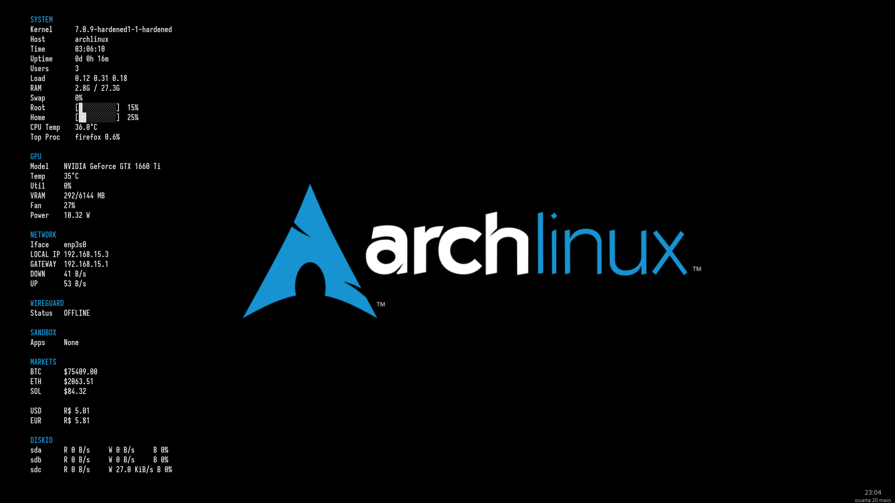

# NyxHUD

HUD modular e extremamente leve para Wayland.

O NyxHUD é um painel de informações com arquitetura modular. Cada fonte
de dados é implementada como um coletor independente em shell POSIX,
enquanto um renderizador leve em Python exibe as informações na tela.



O projeto prioriza simplicidade, código auditável e baixo consumo de
recursos.

## Recursos

-   Wayland nativo
-   Arquitetura modular
-   Coletores em shell POSIX
-   Renderizador leve em Python
-   Offline First
-   Baixo consumo de CPU e memória
-   Fácil criação de módulos

## Estrutura

``` text
nyxhud/
├── main/
│   ├── collectors/
│   ├── renderer/
│   ├── modules/
│   └── cache/
├── start.sh
└── README.md
```

## Dependências

-   Python 3
-   GTK3 (PyGObject)
-   Wayland
-   labwc
-   foot
-   Shell POSIX

Ferramentas opcionais:

-   curl
-   iproute2
-   procps-ng
-   lm_sensors

## Instalação

``` sh
git clone git@github.com:fm4lloc/nyxhud.git
cd nyxhud
./start.sh
```

## Módulos

Os coletores ficam em `main/collectors/` e novos módulos podem ser
adicionados criando novos scripts compatíveis.

## Filosofia

-   KISS
-   Modular
-   Offline First
-   Código auditável
-   Dependências mínimas
-   Comportamento previsível

## Licença

GPL-3.0-or-later
